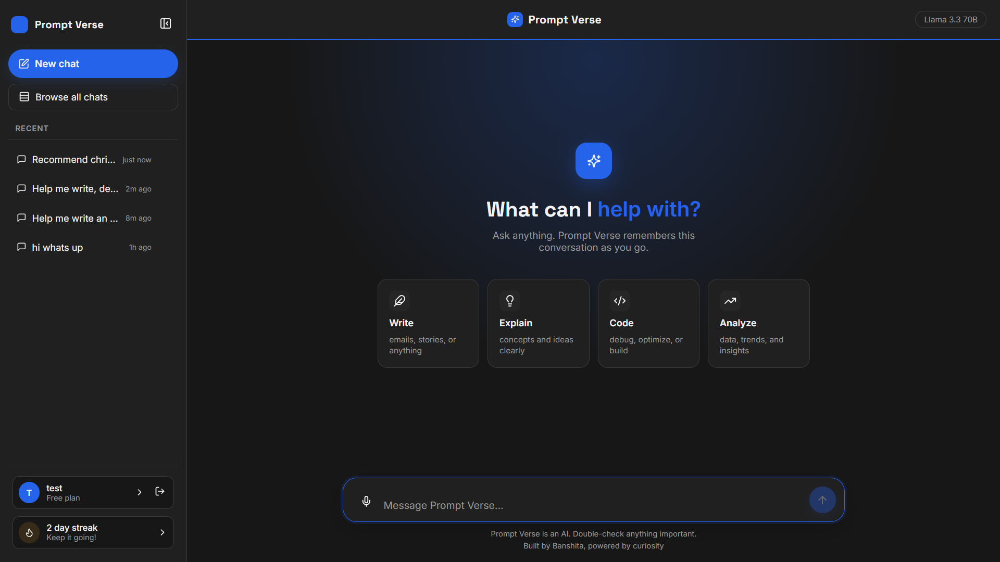
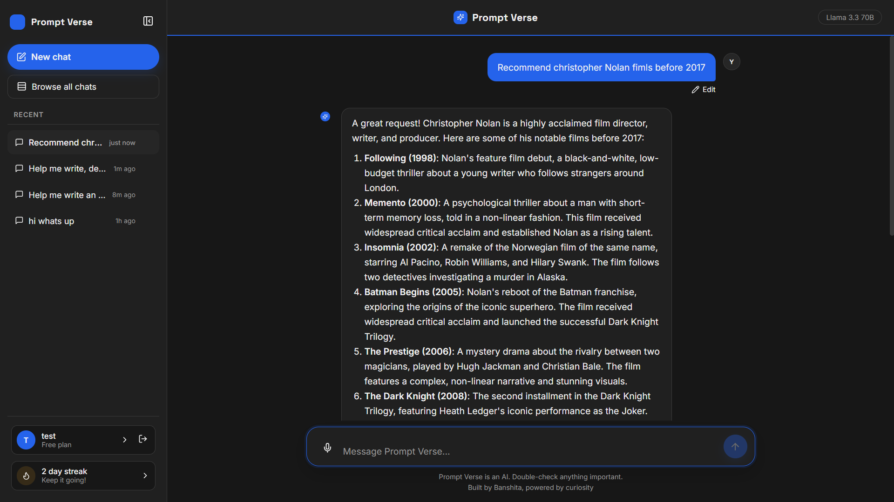

# Prompt Verse

An AI chat app built with React (Vite), Express, MongoDB, and Groq's free Llama model. Includes full email/password and Google authentication, password reset by email, per-user chat history, voice input, and a daily streak counter.

## Screenshots




---

## Features

- Email/password signup and login, plus Google sign-in
- Forgot/reset password flow with a real email sent via Resend
- Sessions last 7 days, then require logging in again
- Every thread is private to the account that created it
- Renameable chat threads, full chat history sidebar with a "browse all chats" view
- Collapsible sidebar
- Voice input using the browser's built-in speech recognition, no API needed
- Stop-generation button, edit-and-resend on your last message, regenerate the last reply
- Daily usage streak tracked locally
- Markdown and code block rendering in replies
- Real-time chat backed by Groq's Llama 3.3 70B model.

---

## Tech stack

```
| Layer | Tech |
|---|---|
| Frontend | React, Vite, React Router, lucide-react, react-markdown |
| Backend | Node.js, Express |
| Database | MongoDB (Atlas free tier) |
| AI | Groq (Llama 3.3 70B) |
| Auth | JWT in an httpOnly cookie, bcrypt, Google OAuth |
| Email | Resend |

```

## Project structure

```
prompt-verse/
├── backend/
│   ├── models/
│   │   ├── User.js
│   │   └── Thread.js
│   ├── middleware/
│   │   └── auth.js
│   ├── routes/
│   │   ├── auth.js
│   │   └── chat.js
│   ├── utils/
│   │   ├── Groq.js
│   │   └── mailer.js
│   ├── server.js
│   └── .env
└── frontend/
    ├── src/
    └── .env
```

## Setup

### .env credentials

| Variable           | Where to get it                                     |
| ------------------ | --------------------------------------------------- |
| `MONGODB_URI`      | mongodb.com/atlas                                   |
| `GROQ_API_KEY`     | console.groq.com/keys                               |
| `PORT`             | any port, defaults to 8080                          |
| `JWT_SECRET`       | secret string                                       |
| `CLIENT_URL`       | frontend's URL, used for CORS and reset-email links |
| `GOOGLE_CLIENT_ID` | Google Cloud Console                                |
| `RESEND_API_KEY`   | resend.com                                          |

### Backend

```bash
cd backend
npm install
cp .env
```

Fill in `.env` with the values, then:

```bash
npm run dev
```

You should see `connected with prompt-verse DataBase!` and `server running on 8080`.

### Frontend

```bash
cd frontend
npm install
cp .env
```

Fill in `.env`, then:

```bash
npm run dev
```

## How login works

- Email/password and Google sign-in both issue a signed session cookie valid for 7 days
- After 7 days you're logged out automatically and sent back to the login page
- Only logged-in users can reach the chat — every thread is tied to the account that created it
- Forgot password sends a real email with a link valid for 30 minutes

## Deploying

- **Backend**: Render
- **Frontend**: Vercel

## Contributing

Contributions are always welcome. See [CONTRIBUTING.md](./CONTRIBUTING.md) for how to get set up and submit a change.

## License

This project is licensed under the [MIT License](./LICENSE).
